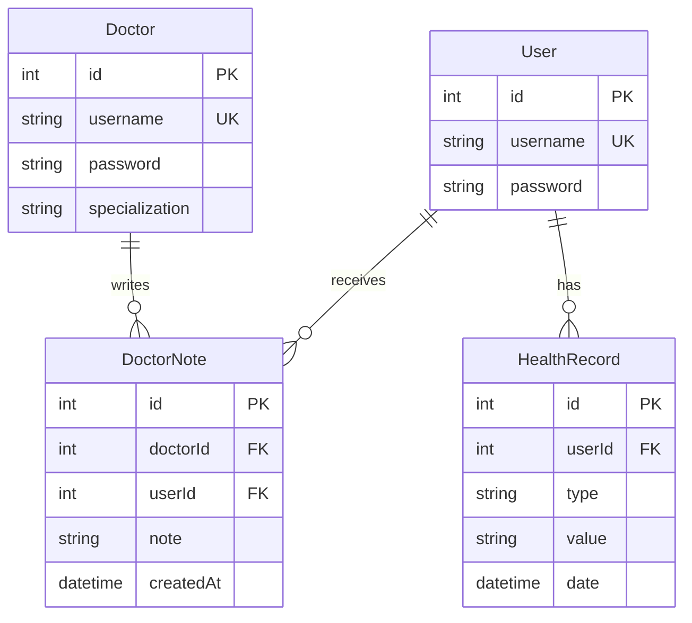

# 📌 ER Diagram: Health Tracker API

## 📋 **Entities & Relationships**

ระบบนี้มี **4 Entity หลัก** และความสัมพันธ์ดังนี้:

1. **Doctor** - เก็บข้อมูลแพทย์
2. **User** - เก็บข้อมูลผู้ป่วย
3. **DoctorNote** - บันทึกคำแนะนำของ Doctor ให้กับ User
4. **HealthRecord** - บันทึกสุขภาพของ User

---

## 🔥 **Entity Details**

### **Doctor**

| Column           | Type       | Description        |
| ---------------- | ---------- | ------------------ |
| `id`             | `Int (PK)` | รหัสแพทย์          |
| `username`       | `String`   | ชื่อแพทย์ (Unique) |
| `password`       | `String`   | รหัสผ่าน (hashed)  |
| `specialization` | `String`   | ความเชี่ยวชาญ      |

### **User**

| Column     | Type       | Description         |
| ---------- | ---------- | ------------------- |
| `id`       | `Int (PK)` | รหัสผู้ใช้          |
| `username` | `String`   | ชื่อผู้ใช้ (Unique) |
| `password` | `String`   | รหัสผ่าน (hashed)   |

### **DoctorNote**

| Column      | Type       | Description       |
| ----------- | ---------- | ----------------- |
| `id`        | `Int (PK)` | รหัสบันทึกคำแนะนำ |
| `doctorId`  | `Int (FK)` | หมอที่ให้คำแนะนำ  |
| `userId`    | `Int (FK)` | ผู้ป่วย           |
| `note`      | `String`   | คำแนะนำจากหมอ     |
| `createdAt` | `DateTime` | เวลาที่สร้าง      |

### **HealthRecord**

| Column   | Type       | Description                |
| -------- | ---------- | -------------------------- |
| `id`     | `Int (PK)` | รหัสบันทึกสุขภาพ           |
| `userId` | `Int (FK)` | เจ้าของบันทึก (User)       |
| `type`   | `String`   | ประเภทข้อมูล (เช่น weight) |
| `value`  | `String`   | ค่าของข้อมูล (เช่น 100 kg) |
| `date`   | `DateTime` | วันที่บันทึก               |

---

## 📌 **Relationships**

- **Doctor (1) → (M) DoctorNote** - หมอสามารถเขียนบันทึกให้ผู้ป่วยได้หลายรายการ
- **User (1) → (M) DoctorNote** - ผู้ป่วยสามารถรับบันทึกจากหมอได้หลายรายการ
- **User (1) → (M) HealthRecord** - ผู้ป่วยสามารถมีบันทึกสุขภาพได้หลายรายการ

---

## 🖼 **ER Diagram**

---
